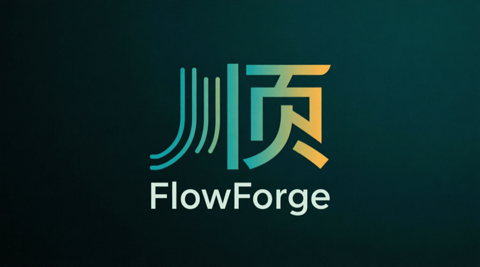

<p align="center">
  
</p>

<p align="center">
  Open-source, local-first, keyboard-driven AI coding interface.
</p>

<p align="center">
  <a href="README.zh-CN.md">中文</a> | English
</p>

---

## Philosophy

FlowForge harnesses AI's **uniform capability** in service of humanity's
**non-uniform agency** — while resisting the **uniform politeness** baked in by
AI training. Three verbs, three layers:

- **Harness** the *structural* layer — an LLM's uniform, tireless attention, as raw material.
- **Serve** the *user* layer — spiky, personal, non-uniform agency; everything bends to it.
- **Resist** the *training* layer — RLHF's pull toward deference. An honest partner beats a polite one.

See [`PRINCIPLES.md`](PRINCIPLES.md) for how this becomes the Four Pillars we build by.

---

## Features

- **Multi-provider LLM** — OpenAI-compatible (Ollama, LM Studio, SiliconFlow, OpenRouter), Anthropic (native Messages API), AWS Bedrock (Converse API)
- **Agent loop** — research, plan, implement, verify — with streaming tool calls and interactive approval
- **Tool system** — bash, edit, view, grep, glob, web_fetch, web_search, python, apply_patch, and more
- **MCP host** — connect external tool servers (stdio/SSE) with health monitoring and auto-restart
- **Memory** — durable Markdown source-of-truth + SQLite FTS5 recall + optional local embeddings (hybrid BM25 + vector)
- **Skills & phenotypes** — hot-reloadable YAML-manifest skills, composable agent personas
- **Scheduled tasks** — cron-style automation with configurable approval ceilings
- **Multi-pane sessions** — split-view editor, per-pane workspace and model binding
- **CLI** — headless scripting with the same agent loop, CI-friendly exit codes
- **Plan / Auto / Act modes** — dial agent autonomy from read-only analysis to full execution

## Tech Stack

| Layer | Technology |
|-------|-----------|
| Shell | Tauri 2 (Rust backend + OS webview) |
| Frontend | React 19 + TypeScript + Vite |
| State | Zustand |
| Storage | SQLite (sessions, memory index, scheduled tasks, flush ledger) |
| Styling | Tailwind CSS + shadcn/ui |
| AI | Multi-provider: OpenAI-compatible, Anthropic, Bedrock, Ollama (native) |

## Architecture

```
┌─────────────────────────────────────────────────────────────┐
│                      FlowForge Desktop                       │
│                        (Tauri 2)                             │
├─────────────────────────────────────────────────────────────┤
│  ┌───────────────────────────────────────────────────────┐  │
│  │              React Frontend (Webview)                  │  │
│  │                                                       │  │
│  │  ┌─────────────┐  ┌──────────────┐  ┌────────────┐  │  │
│  │  │  Chat View  │  │  Split Panes │  │  Settings  │  │  │
│  │  │  (streams)  │  │  (#148)      │  │  Panel     │  │  │
│  │  └─────────────┘  └──────────────┘  └────────────┘  │  │
│  │                                                       │  │
│  │  ┌─────────────────────────────────────────────────┐  │  │
│  │  │                 Zustand Store                    │  │  │
│  │  └─────────────────────────────────────────────────┘  │  │
│  └───────────────────────┬───────────────────────────────┘  │
│                          │ Tauri IPC (invoke / events)       │
├──────────────────────────┼──────────────────────────────────┤
│  ┌───────────────────────┴───────────────────────────────┐  │
│  │                 Rust Backend                           │  │
│  │                                                       │  │
│  │  ┌───────────┐  ┌───────────┐  ┌──────────────────┐  │  │
│  │  │ ff-agent  │  │  ff-llm   │  │    ff-memory     │  │  │
│  │  │ (loop &   │  │ (OpenAI,  │  │ (Markdown +      │  │  │
│  │  │  tools)   │  │  Bedrock, │  │  FTS5 + embed)   │  │  │
│  │  │           │  │  Anthropic,│  │                  │  │  │
│  │  │           │  │  Ollama)  │  │                  │  │  │
│  │  └───────────┘  └───────────┘  └──────────────────┘  │  │
│  │                                                       │  │
│  │  ┌───────────┐  ┌───────────┐  ┌──────────────────┐  │  │
│  │  │ff-session │  │  ff-mcp   │  │   ff-skills      │  │  │
│  │  │(SQLite    │  │ (MCP host │  │ (discovery,      │  │  │
│  │  │ store)    │  │  + supvr) │  │  hot-reload)     │  │  │
│  │  └───────────┘  └───────────┘  └──────────────────┘  │  │
│  │                                                       │  │
│  │  ┌───────────┐  ┌───────────┐  ┌──────────────────┐  │  │
│  │  │ff-signals │  │ff-scheduled│ │   ff-tools       │  │  │
│  │  │(telemetry │  │ (cron     │  │ (bash, edit,     │  │  │
│  │  │ + signals)│  │  runner)  │  │  view, web, ...) │  │  │
│  │  └───────────┘  └───────────┘  └──────────────────┘  │  │
│  └───────────────────────────────────────────────────────┘  │
├─────────────────────────────────────────────────────────────┤
│                    Local Storage Layer                        │
│  ┌──────────────┐  ┌──────────────┐  ┌──────────────────┐  │
│  │   SQLite DB  │  │  ~/.flowforge│  │  Skills (MD +    │  │
│  │ (sessions,   │  │  /memory/    │  │  YAML manifests) │  │
│  │  scheduled)  │  │  (flat files)│  │                  │  │
│  └──────────────┘  └──────────────┘  └──────────────────┘  │
└─────────────────────────────────────────────────────────────┘
         │                    │
         ▼                    ▼
┌─────────────────┐  ┌────────────────┐
│  LLM Providers  │  │  MCP Servers   │
│  (OpenAI-compat,│  │  (stdio/SSE,   │
│   Bedrock,      │  │   external     │
│   Anthropic,    │  │   tools)       │
│   Ollama)       │  │                │
└─────────────────┘  └────────────────┘
```

### Crate Map

| Crate | Role |
|-------|------|
| `ff-core` | Domain types — Message, Turn, Skill, Profile, ProviderConnection |
| `ff-agent` | Agent loop (tool dispatch, compaction, approval gate) |
| `ff-llm` | Provider trait + implementations (OpenAI-compatible, Anthropic, Bedrock, Ollama) |
| `ff-mcp` | MCP client & supervisor — health monitoring, auto-restart, env isolation |
| `ff-memory` | Markdown-owned durable memory + SQLite FTS5 recall + optional embeddings ([RFC 0006](docs/rfcs/0006-memory.md)) |
| `ff-session` | Session persistence (SQLite store, transcript CRUD) |
| `ff-signals` | Skill telemetry aggregates (activation count, cost, latency, success rate) + signal bus for future NeuroForge integration |
| `ff-skills` | Skill discovery, YAML manifest parsing, phenotype resolution, hot-reload |
| `ff-scheduled` | Cron-style task runner with configurable approval ceilings |
| `ff-tools` | Built-in tools: bash, edit, view, grep, glob, web_fetch, web_search, python, apply_patch |
| `ff-workflow` | Multi-agent orchestration *(planned — M7)* |

## Development

```bash
# Prerequisites: Rust 1.80+, Node 20+, pnpm 9+
git clone https://github.com/flowforge-lab/FlowForge.git
cd FlowForge

# Install frontend deps
pnpm install

# Run in development (Tauri hot-reload)
cargo tauri dev

# UI-only: run the frontend against the in-browser mock backend
# (no Rust build, no LLM required — great for pure UI/styling work)
pnpm --dir apps/desktop dev:mock

# Build for production
cargo tauri build
```

## CLI

FlowForge ships a CLI binary (`flowforge`) for scripting, CI, and headless use — same agent loop, same tools, no GUI.

```bash
# One-shot: run a single turn and print the result
flowforge run "summarize the contents of src/"

# Non-interactive: auto-approve writes, stream JSON events to stdout
flowforge run --json --yes "add a README section for the new memory crate"

# Read-only analysis: deny all writes (safe default for CI)
flowforge run --deny "audit src/ for unused dependencies"

# Interactive REPL (default when no subcommand is given)
flowforge
```

### Exit codes

- **0** — turn completed successfully (or clean REPL shutdown).
- **non-zero** — agent error, or a required tool approval was denied.

When stdin is not a terminal and no `--yes` or `--deny` flag is provided, every write/dangerous tool call is **denied by default** — making `--deny` the safe CI default and `--yes` the explicit opt-in for autonomous runs.

## Roadmap

- [x] **M1** — Tauri 2 shell + React chat UI + first LLM call
- [x] **M2** — Tool calling (bash, view, edit) + streaming + interactive approval
- [x] **M3** — Skills + phenotypes + command palette
- [x] **M4** — MCP host & supervisor — external tool servers, lifecycle UI
- [x] **M5** — Memory system — Markdown + FTS5 recall + optional embeddings ([RFC 0006](docs/rfcs/0006-memory.md))
- 🚧 **M6** — Cold-start optimization (<200ms target)
- 🔮 **M7** — Workflow canvas (visual multi-agent orchestration)

### 0.2.0 (next)

- Permission matrix restructure — `Safety::Sensitive` tier + editable Control panel ([RFC 0019](docs/rfcs/0019-permission-matrix-and-sensitive-tier.md), [#682](https://github.com/flowforge-lab/FlowForge/issues/682))
- Goal mode — persistent autonomous objective loop ([#683](https://github.com/flowforge-lab/FlowForge/issues/683))
- Dogfood harness — FlowForge developing FlowForge ([#684](https://github.com/flowforge-lab/FlowForge/issues/684))

## NeuroForge (Planned)

FlowForge and NeuroForge are separate but complementary systems. NeuroForge is a planned cognitive-health layer that consumes FlowForge's intention/outcome signals to model focus states, reward prediction, and adaptive pacing — inspired by neuroscience research on flow, aMCC activation, and dopamine-driven learning.

FlowForge is fully functional standalone. NeuroForge integration will unlock a closed-loop cognitive feedback system for users who opt in.

| Project | Role | Status |
|---------|------|--------|
| **FlowForge** (this repo) | Open AI coding interface — local-first, keyboard-native | Active |
| **NeuroForge** | Cognitive health plugin — RPE models, flow scoring, adaptive pacing | Planned |
| **NeuroForge Cloud** | Cross-device sync, team features, hosted inference | Future |

## License

[MIT](./LICENSE)
